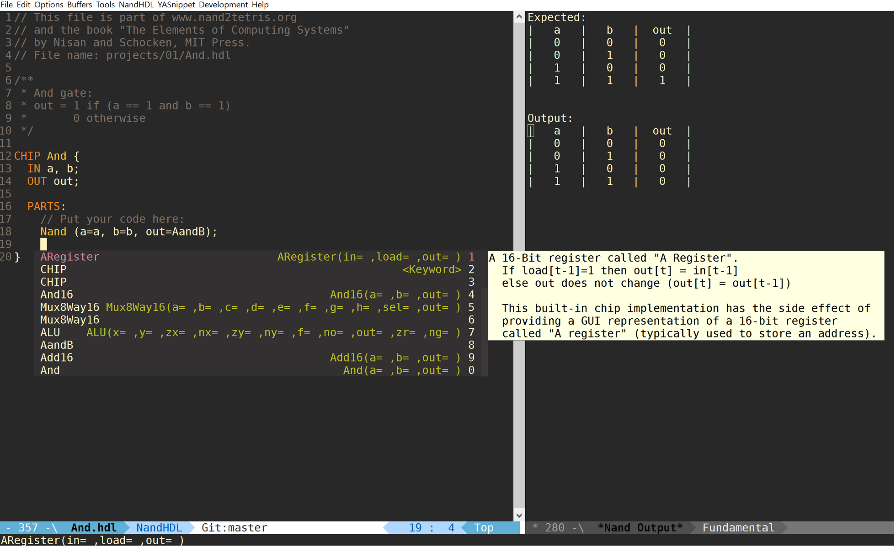

## Emacs major mode for Nand2Tetris(NAND) hdl files (.hdl)

[](https://www.gnu.org/licenses/gpl-3.0)

Emac major  mode for NAND  hardward description  language files (.hdl)  from the
coursera class nand2tetris.

See [jack-mode](https://github.com/nverno/jack-mode) for a Jack major-mode.

## The mode provides

- syntax / font-locking
- customizable indentation: choose indentation for IN/OUT declarations,
  PARTS, and general offset.
- Compilation support, running the chip in simulator, and jumping to mismatches
  in .out file.
- Comparison buffer for expected vs. output. (`C-c C-c`)
- imenu, other user functions, etc.
- Autocompletion / dropdown help using `company-nand` with
  `company-mode` and `company-quickhelp`

Tools in build directory:

- Autogenerate snippets from the HDL survival website (for use with yasnippet)
- Autogenerate docs.txt from builtin chips.

Todo:

- Completion-at-point functions.
- Jump to definitions

### Installation

Require this file or autoload mode / compile.
Snippets can be enabled by simply enabling `yas-minor-mode` in
`nand-hdl-mode-hook`.

The variable `nand-hdl-directory` needs to be set to point to
the installation directory of nand2tetris, ie the directory
containing 'tools' and 'projects' directories.

```lisp
;; Example
(require 'nand-hdl-mode)
(add-hook 'nand-hdl-mode-hook 'yas-minor-mode)
```

See `company-nand` for autocompletion setup.


