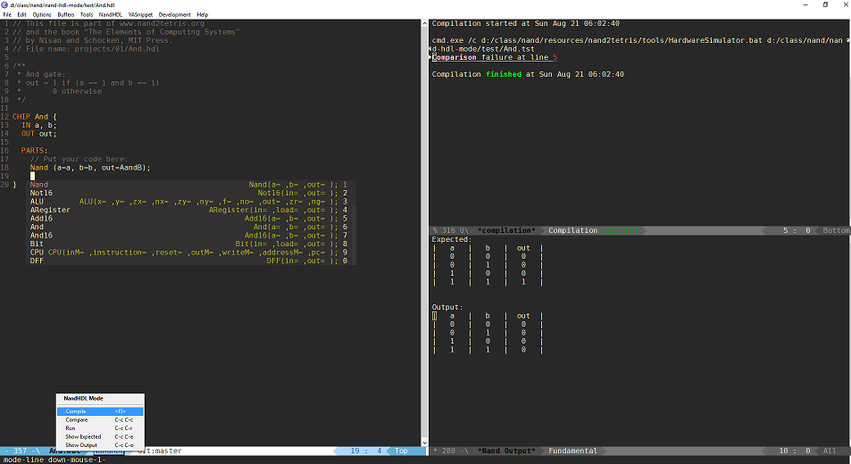

*Author:* Noah Peart <noah.v.peart@gmail.com> 
*URL:* [https://github.com/nverno/hdl-mode](https://github.com/nverno/hdl-mode) 

Description:

Emac major mode for NAND hardward description language files (.hdl) as 
defined by the coursera class nand2tetris.

## The mode provides

- syntax / font-locking
- customizable indentation: choose indentation for IN/OUT declarations,
  PARTS, and general offset.
- Compilation support, running the chip in simulator, and jumping to mismatches
  in .out file.
- Comparison buffer for expected vs. output. (`C-c C-c`)
- imenu, other user functions, etc.

Tools in build directory:
- Autogenerate snippets from the HDL survival website (for use with yasnippet)
- Autogenerate docs.txt from builtin chips.

Todo:
- Completion-at-point functions.
- Use docs to provide `company-quickhelp` support.
- Jump to definitions

### Installation

Require this file or autoload mode / compile.  Add snippets if using yasnippet.

---
Converted from `nand-hdl-mode.el` by [*el2markdown*](https://github.com/Lindydancer/el2markdown).
